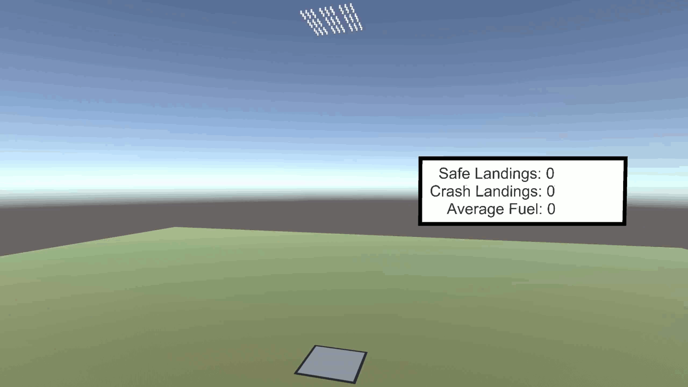

# Space Lander AI
This project is an attempt to create an AI that can control the thrust of a lander and have it land on the ground safely.
I will use [ML-Agents Toolkit](https://github.com/Unity-Technologies/ml-agents/blob/main/README.md) in Unity game engine to create this environment and train the ML model.

## Motivation
While looking around the internet trying to find a fun ML project to do, I stumbled upon ML-Agents. I was originally thinking of finding a video game to make an AI for, but figured this would be better as I can create my own environment with my own problem to solve. To pick the problem, I was inspired by SpaceX's Falcon 9 stage landing

I watch many of SpaceX's streams and am blown away how they can maneuver this massive object on this tiny barge. While this problem can be solved with kinematic equations and simple code, I wanted to try to teach an ML model to do this anyway.

## Environment
The environment we'll be working with is very simple: a cylinder (our lander) dropping onto a plane (our landing pad). The lander has mass and is pulled down by the force of gravity. For now, it is locked in the Y axis and cannot move in the X or Z directions. If it hits the landing pad with an impulse larger than a given threshold, the lander will crash. When the lander either crashes or lands safely, it will reset back up to a position in the air where it will fall again. The gif below demonstrates what it looks like when a lander lands safely or crashes.

The first lander (very left) is thrusting upward at 9.81 m/s^2 which means that it is perfectly counteracting gravity and floating in the air. The second lander is thrusting a little below 9m/s^2 and descends slow enough to land safely. The third lander is JUST below the threshold of crashing. The fourth lander does not thrust enough and crashes. The last lander does not thrust at all and is in free fall.

Having just one lander will take too long to train, so we create multiple landers that all share the same brain and land as a group. We have 81 landers, which means the training session will be ~81X faster. We stop at this number as more landers cause the simulation to lag, giving us diminishing returns of training time.

A timelapse of the creation of the environment is shown below

## Training to Survive
The agent learns by playing out episodes. Each episode starts the agent in the exact same state as it was at the start of any other episode. When some condition is met, the episode will end, the agent will be rewarded, and the agent is reset to the original state. Every episode is composed of hundreds/thousands of steps. Each step is a fraction of a second where the agent:
1) Collects observations (input)
2) Makes a decision
3) Takes action (output)

After the episode ends, the agent will reflect upon it's past decisions. At first the agent makes totally random decisions, but after its reward, it will increase the likelihood of repeating the correct decision that led up to it being rewarded.

The ML agent we are using will be simple and will have 2 inputs and 1 output. It will observe the instantaneous Y position and velocity of the lander and it will decide to move the throttle up or down. The episode ends when the lander makes contact with the ground and agent is rewarded if it hits the ground at a low speed. It will receive 1 point for landing safely and -1 point for crashing. Also, if the lander thrusts upward and hits a maximum y value, it will punished and the episode will reset. Going upward is almost certainly not how to land.

Here are the first results of this training:

The landers hover just below the invisible ceiling (the max Y value near the top of the gif) and avoid touching the ground altogether. I think I have set up my reward structure wrong. My theory is that the landers do not want to get punished by going past the max Y but they also do not want to get punished for crashing into the ground. They have figured out that because they have infinite fuel and infinite time, they can avoid punishment altogether if they just hover in the middle for the rest of time. I would like to remain having infinite fuel to keep my simulation simple, so I will remove the infinite time by limiting each episode by a max number of steps.

The landers have found out that they DO want to fall to the ground and most have found out how to land safely! The strategy the landers used to achieve this is pretty predictable: fall really really slowly. While we achieved our first goal of survival, this strategy is boring AND does not conserve valuable fuel. When landing on the Moon or Mars, fuel is really important and cannot be wasted by making the safest landing possible.

## Training for Efficiency

My new goal is to acheive the perfect [suicide-burn](https://space.stackexchange.com/questions/10307/what-is-a-suicide-burn). A suicide burn is the most effecient way to land a rocket. The idea is you let the lander free fall all the way down and at a certain point you throttle all engines up to max. If done at the correct point, the thrust will slow you down just in time to hit the ground at 0 velocity. I have used kinematic equations to find this point and have added a "Math Mode" to my lander script. This is what it looks like:

Now that we have a new goal, let's try to train our model well enough to replicate this.

In addition to receiving 1 point for landing safely and -1 point for crashing, the lander will receive 1 additional point for conserving fuel and 1 additional point for having the softest landing possible. 

I calculate the best possible fuel usage and divide that by actual fuel used (ExpectedFuelUsage / FuelUsed). If FuelUsed is perfect and is equal to ExpectedFuelUsage, the full 1 point will be rewarded. If the FuelUsed is twice that of ExpectedFuelUsage, only half of the point will be rewarded and so on.

Even though all we care about is our lander landing within a given threshold and not crashing, we still want to incentivise it to land with the ideal velocity of 0m/s. We will add (1 - LandingImpulse / ImpulseTheshold) to our reward equation. If the LandingImpulse is equal to the ImpulseTheshold, it will be rewarded 0 points. If LandingImpulse is close to 0, it will rewarded 1 point.

Lets train some landers and see this new reward system in action.

This is MUCH better. As you can see by the Average Fuel Used, we have nearly saved half of the fuel we used last attempt. It could be better though. This training session, as well as the last, were only ~2 minutes long. This next training session I will let go on for 1 hour.

We have achieved the suicide-burn! Our landers very closely replicate the simulation using kinematic equations shown earlier. While I'm happy with the progress so far, we need to take this further. Up until this point, we have only had our landers start at a single height. If we want our AI to land on different planets, well need it to work at many different heights. This is what happens when we drop our current lander AI at random heights:

The majority of the landers get confused and hover near the top. My theory is that the only lesson that was learned is "If Im at this height, don't thrust. If Im at this height, start thrusting." The landers that started out at the "thrusting" region started thrusting upward to the "no thrust" region. They got trapped because they do not have the speed to fall below the "thrust" region. 

To fix this issue, I will do another hour long training session with starting heights randomized.

SUCCESS! The lander now performs a suicide burn no matter what height it starts out at.

